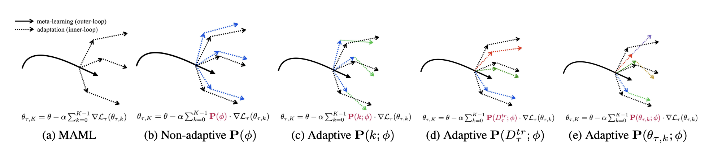
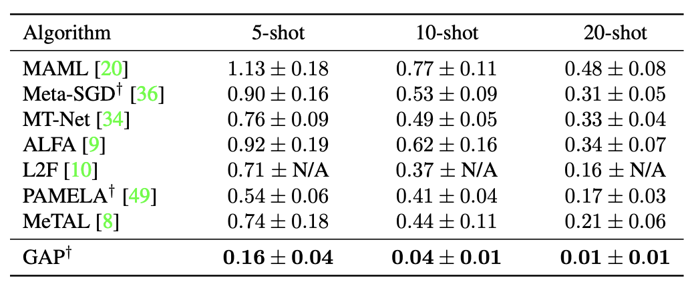
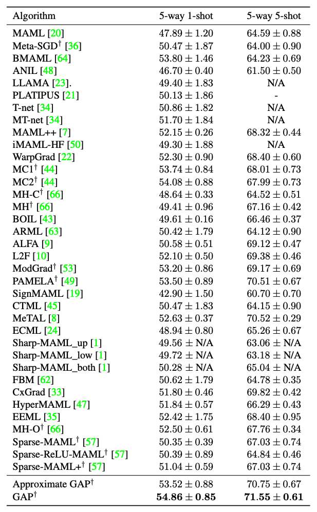
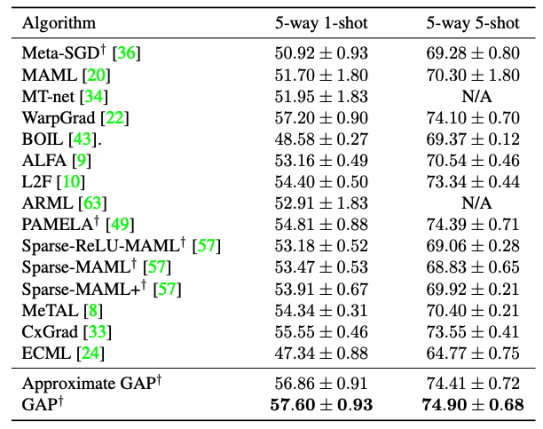
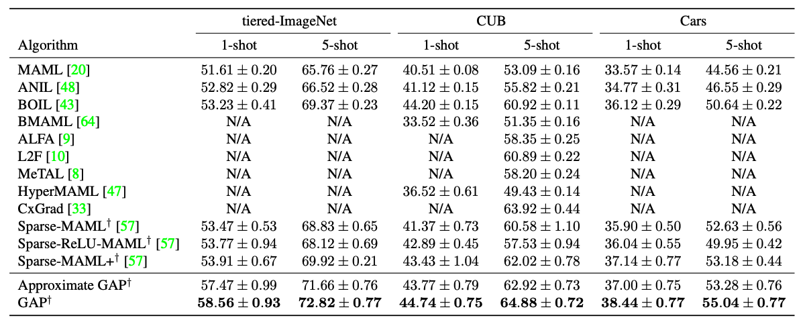

# (CVPR 2023) Meta-Learning with a Geometry-Adaptive Preconditioner

This repository provides a Official PyTorch implementation of our CVPR 2023 paper ***Meta-Learning with a Geometry-Adaptive Preconditioner.***
+ [CVPR 2023 paper (will be made available)](https://...) 
+ [arXiv version (will be made available)](https://...)

## Abstract
<p float="left">

Model-agnostic meta-learning (MAML) is one of the most successful meta-learning algorithms. 
It has a bi-level optimization structure where the outer-loop process learns a shared initialization and the inner-loop process optimizes task-specific weights. 
Although MAML relies on the standard gradient descent in the inner-loop, recent studies have shown that controlling the inner-loop’s gradient descent with a meta-learned preconditioner can be beneficial. 
Existing preconditioners, however, cannot simultaneously adapt in a task-specific and path-dependent way. 
Additionally, they do not satisfy the Riemannian metric condition, which can enable the steepest descent learning with preconditioned gradient. 
In this study, we propose Geometry-Adaptive Preconditioned gradient descent (GAP) that can overcome the limitations in MAML; 
GAP can efficiently meta-learn a preconditioner that is dependent on task-specific parameters, and its preconditioner can be shown to be a Riemannian metric. 
Thanks to the two properties, the geometry-adaptive preconditioner is effective for improving the inner-loop optimization. 
Experiment results show that GAP outperforms the state-of-the-art MAML family and preconditioned gradient descent-MAML (PGD-MAML) family in a variety of few-shot learning tasks.

## Our main contributions
- We propose `a new preconditioned gradient descent method called GAP`, where it learns a preconditioner that enables a geometry-adaptive learning in the inner-loop optimization.
- We prove that GAP's preconditioner has two desirable properties: (1) It is `both task-specific and path-dependent`. (2) It is a `Riemannian metric`.
- For large-scale architectures, we provide `a low-computational approximation called Approximate GAP` that can be theoretically shown to approximate the GAP method. 
- For popular few-shot learning benchmark tasks, we empirically show that `GAP outperforms the state-of-the-art MAML family and PGD-MAML family`.

## Requirements
This codes requires the following
- Python 3.6 or above
- PyTorch 1.8 or above
- Torchvision 0.5 or above
- Torchmeta 1.8

## Getting started
- **mini-ImageNet**
  - Download _mini-imagenet.tar.gz_ from https://github.com/renmengye/few-shot-ssl-public
  - Make the folder _miniimagenet_ and move the _mini-imagenet.tar.gz_ into _miniimagenet_.
  - Set the path of the folder where the data is downloaded through the argument `--folder`
  - Require argument `--download` when running the command for the first time.
- **tiered-ImageNet**
  - Download _tiered-imagenet.tar_ from https://github.com/renmengye/few-shot-ssl-public
  - Make the folder _tieredimagenet_ and move the _tiered-imagenet.tar_ into _tieredimagenet_.
  - Set the path of the folder where the data is downloaded through the argument `--folder`.
  - Require argument `--download` when running the command for the first time.
- **Cars**
  - Download _cars_train.tgz_ and _cars_test.tgz_ from http://imagenet.stanford.edu/internal/car196/
  - Download _car_devkit.tgz_ from https://ai.stanford.edu/~jkrause/cars/
  - Make the folder _cars_ and move the _cars_train.tgz_, _cars_test.tgz_, and _car_devkit.tgz_ into _tieredimagenet_.
  - Set the path of the folder where the data is downloaded through the argument `--folder`.
  - Require argument `--download` when running the command for the first time.
- **tiered-ImageNet**
  - Download _CUB_200_2011.tgz_ dataset from http://www.vision.caltech.edu/visipedia-data/CUB-200-2011/
  - Make the folder _CUB_200_2011.tgz_ and move the _CUB_200_2011.tgz_ into _cub_.
  - Set the path of the folder where the data is downloaded through the argument `--folder`.
  - Require argument `--download` when running the command for the first time.

## Training
If you want to train 4-Conv network on mini-ImageNet, run this command:
```
# GAP on 5-way 1-shot
python main.py --dataset miniImageNet --gpu_id 0 --N_ways 5 --K_shots_for_support 1 --iter 80000 --outer_lr1 0.0001 --outer_lr2 0.003 --batch_size 4 --use-cuda --GAP --download

# GAP on 5-way 5-shot
python main.py --dataset miniImageNet --gpu_id 0 --N_ways 5 --K_shots_for_support 5 --iter 80000 --outer_lr1 0.0001 --outer_lr2 0.0001 --batch_size 2 --use-cuda --GAP --download

# Approximate GAP on 5-way 1-shot
python main.py --dataset miniImageNet --gpu_id 0 --N_ways 5 --K_shots_for_support 1 --iter 80000 --outer_lr1 0.0001 --outer_lr2 0.003 --batch_size 4 --use-cuda --GAP --approx --download

# Approximate GAP on 5-way 5-shot
python main.py --dataset miniImageNet --gpu_id 0 --N_ways 5 --K_shots_for_support 5 --iter 80000 --outer_lr1 0.0001 --outer_lr2 0.0001 --batch_size 2 --use-cuda --GAP --approx --download
```

If you want to train 4-Conv network on tiered-ImageNet, run this command:
```
# GAP on 5-way 1-shot
python main.py --dataset tieredImageNet --gpu_id 0 --N_ways 5 --K_shots_for_support 1 --iter 130000 --outer_lr1 0.0001 --outer_lr2 0.003 --batch_size 4 --use-cuda --GAP --download

# GAP on 5-way 5-shot
python main.py --dataset tieredImageNet --gpu_id 0 --N_ways 5 --K_shots_for_support 5 --iter 200000 --outer_lr1 0.0001 --outer_lr2 0.0001 --batch_size 2 --use-cuda --GAP --download

# Approximate GAP on 5-way 1-shot
python main.py --dataset tieredImageNet --gpu_id 0 --N_ways 5 --K_shots_for_support 1 --iter 130000 --outer_lr1 0.0001 --outer_lr2 0.003 --batch_size 4 --use-cuda --GAP --approx --download

# Approximate GAP on 5-way 5-shot
python main.py --dataset tieredImageNet --gpu_id 0 --N_ways 5 --K_shots_for_support 5 --iter 200000 --outer_lr1 0.0001 --outer_lr2 0.0001 --batch_size 2 --use-cuda --GAP --approx --download
```

## Evaluation
To evaluate the trained model(s) using GAP, run this command:
```
# Source: miniImageNet >> Target: miniImageNet on 5-way 1-shot
python main.py --dataset_for_source miniImageNet --dataset_for_target miniImageNet --gpu_id 0 --N_ways 5 --K_shots_for_support 1 --use-cuda --GAP --test

# Source: miniImageNet >> Target: tieredImageNet on 5-way 1-shot
python main.py --dataset_for_source miniImageNet --dataset_for_target tieredImageNet --gpu_id 0 --N_ways 5 --K_shots_for_support 1 --use-cuda --GAP --test

# Source: miniImageNet >> Target: Cars on 5-way 1-shot
python main.py --dataset_for_source miniImageNet --dataset_for_target CARS --gpu_id 0 --N_ways 5 --K_shots_for_support 1 --use-cuda --GAP --test

# Source: miniImageNet >> Target: CUB on 5-way 1-shot
python main.py --dataset_for_source miniImageNet --dataset_for_target CUB --gpu_id 0 --N_ways 5 --K_shots_for_support 1 --use-cuda --GAP --test
```

## Evaluation
To evaluate the trained model(s) using Approximate GAP, run this command:
```
# Source: miniImageNet >> Target: miniImageNet on 5-way 1-shot
python main.py --dataset_for_source miniImageNet --dataset_for_target miniImageNet --gpu_id 0 --N_ways 5 --K_shots_for_support 1 --use-cuda --GAP --approx --test

# Source: miniImageNet >> Target: tieredImageNet on 5-way 1-shot
python main.py --dataset_for_source miniImageNet --dataset_for_target tieredImageNet --gpu_id 0 --N_ways 5 --K_shots_for_support 1 --use-cuda --GAP --approx --test

# Source: miniImageNet >> Target: Cars on 5-way 1-shot
python main.py --dataset_for_source miniImageNet --dataset_for_target CARS --gpu_id 0 --N_ways 5 --K_shots_for_support 1 --use-cuda --GAP --approx --test

# Source: miniImageNet >> Target: CUB on 5-way 1-shot
python main.py --dataset_for_source miniImageNet --dataset_for_target CUB --gpu_id 0 --N_ways 5 --K_shots_for_support 1 --use-cuda --GAP --approx --test
```

## Experimental Results
- **Few-shot Regression for the sinusoid regression benchmark**
<p float="left">


- **Few-shot classification on mini-ImageNet benchmark**
<p float="left">


- **Few-shot classification on tiered-ImageNet benchmark**
<p float="left">


- **Few-shot cross domain classification benchmark**
<p float="left">


## Citation
Please consider citing our work if you find our repository/paper useful.
```
@inproceedings{currently not available
}
```

## Contact
Please contact the author if you have any questions about our repository/paper: Suhyun Kang (`su_hyun@snu.ac.kr`).
